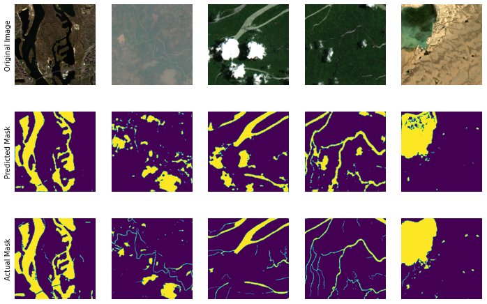

## Earth Surface Water Image Segmentation

We use satellite images from Sentinel 2 to identify which portions of the image correspond to water, using the dataset from [Luo et al.'s 2021 paper](https://www.sciencedirect.com/science/article/pii/S0303243421001793). 

For semantic segmentation, we use the U-Net++ architecture, with a Resnet34 backbone for our encoder. Although Sentinel-2 operates with 13 bands, Luo et al. in making their dataset have discarded the 7 lowest-resolution bands. Therefore, we have a 6-channel input images. Post-segmentation, each pixel will be classified as either water or land. Training was done from scratch, without use of pretrained layers.

## Example Segmentations from the Trained Unet++ model

